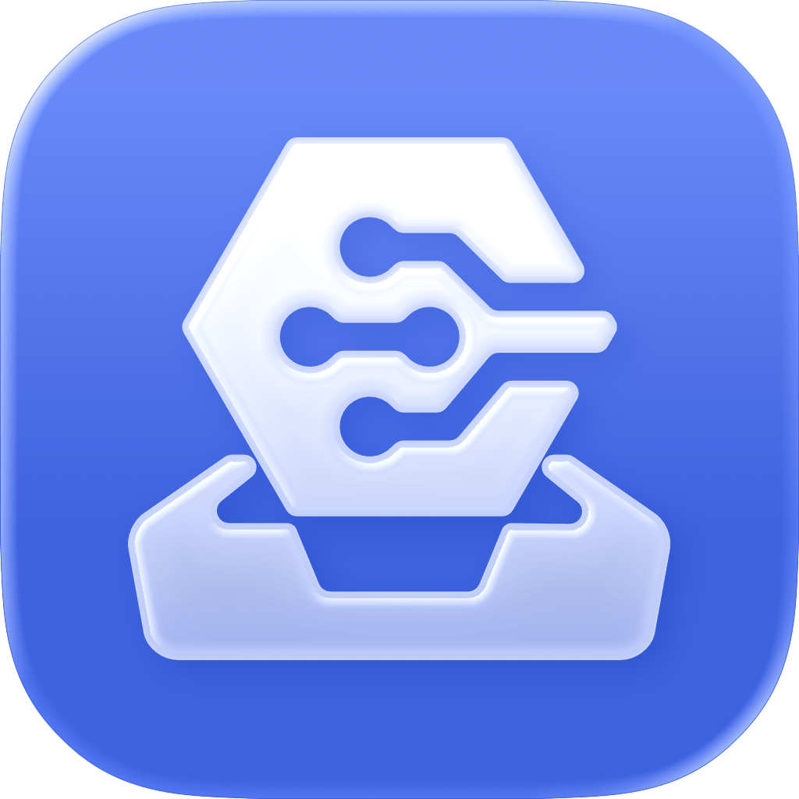
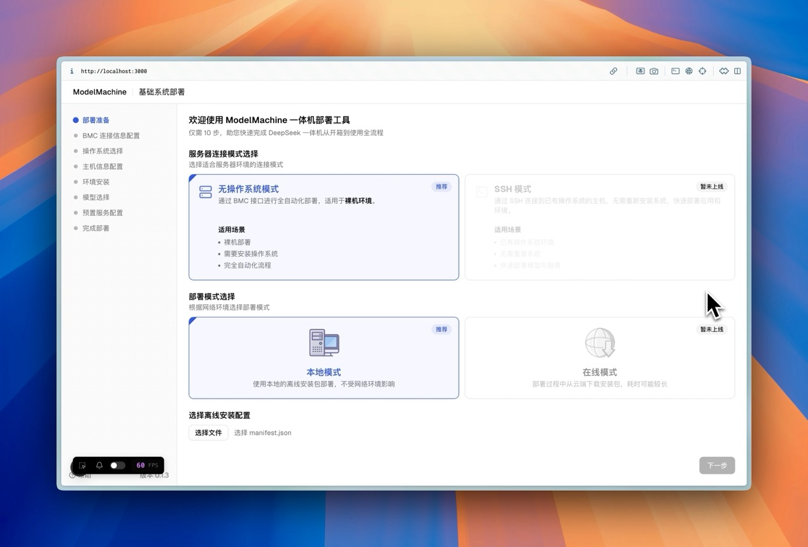
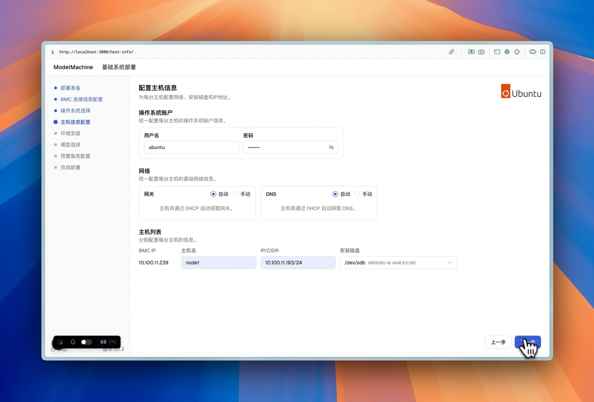
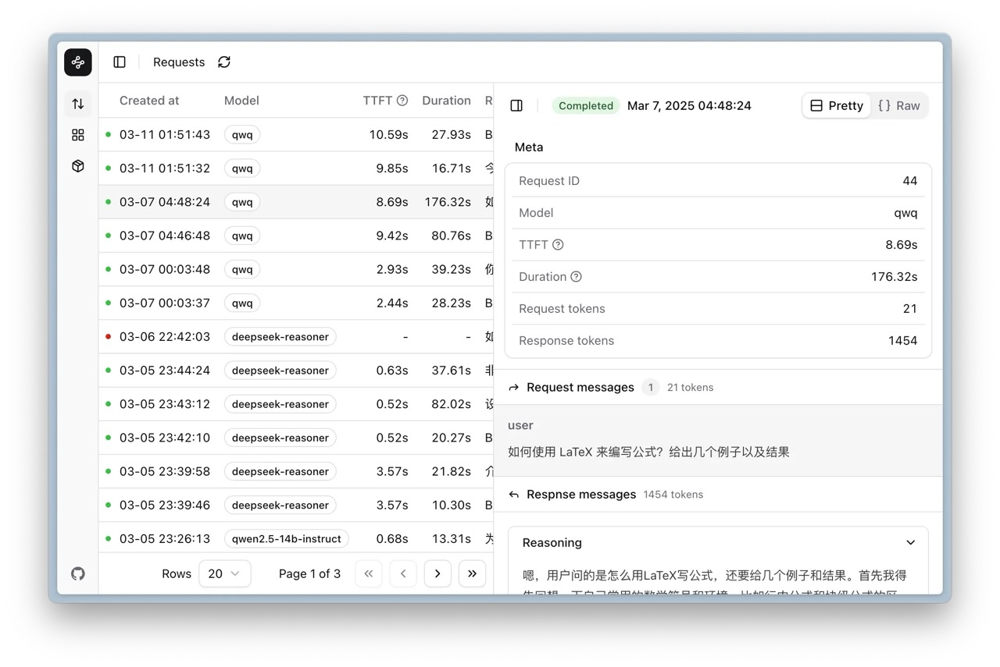
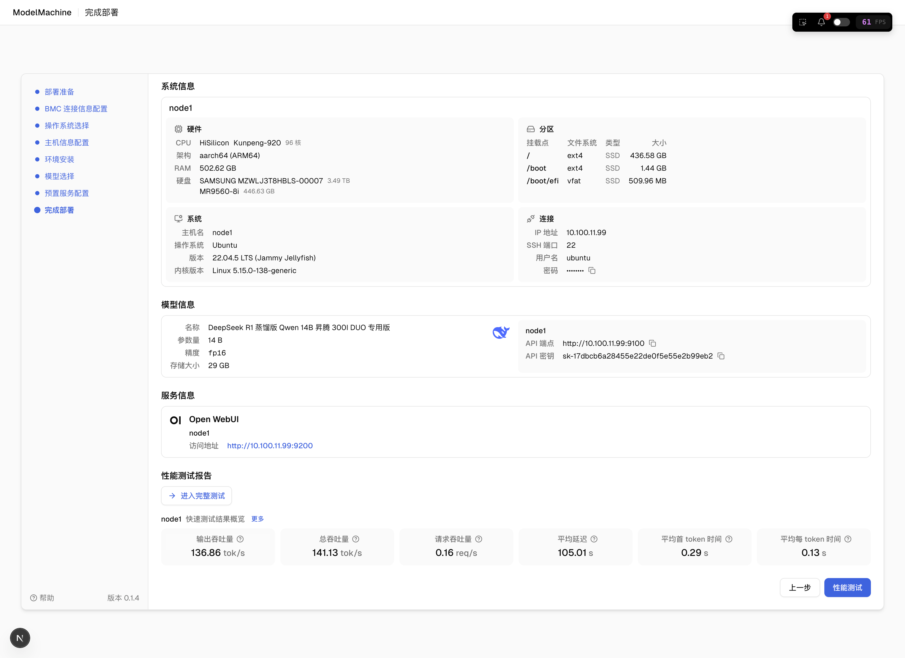

# LLMOne

  <a href="README.md">中文</a>

Enterprise-grade Large Language Model Deployment and Service Platform, making LLMs truly "ready-to-use" 
Committed to enabling every organization and super individual to easily own their own <b>"Intelligent Infrastructure"</b>
 

[Download](https://github.com/EM-GeekLab/LLMOne/releases) | [Quick Start](#-quick-start) | [Roadmap](#️-roadmap) | [Documentation](https://geektechstudio.feishu.cn/wiki/UqP4w82n7ipacukdXe6cclL5nlb)

LLMOne is an open-source, lightweight **enterprise-grade large language model deployment and service platform**. It aims to solve the pain points of traditional LLM private deployment including long deployment cycles, complex configurations, performance challenges, and high operational costs.

  
  
<small>Figure 1: LLMOne Homepage - Clean and intuitive operation interface</small>

**Whether you are:**

* **Developer or vendor of large language model applications (such as OpenWebUI, Dify, RAGFlow, etc.)**: LLMOne helps you quickly and standardly deploy applications to customers' private hardware. In the future, through the "Deploy on LLMOne" feature, you can achieve one-click integration and delivery.
* **LLM appliance manufacturer or system integrator**: LLMOne provides full-stack automated deployment capabilities from operating systems and drivers to model services, significantly shortening delivery cycles, reducing operational complexity, and enhancing the added value of hardware products, making your hardware truly "out-of-the-box service".
* **Tech enthusiasts or enterprise users with high-performance devices (such as NVIDIA DGX-level servers/workstations, Mac Studio/Mini, etc.)**: LLMOne helps you quickly build high-performance, highly reliable LLM inference services on your own hardware, eliminating tedious environment configuration and optimization work.

Through highly automated deployment processes and optimized runtime environments, LLMOne simplifies complex deployment processes into a few clicks, ensuring enterprise-grade performance and stability, allowing you to focus more on LLM application innovation and value realization.

|  |  |
| :----------------------------------------------------------------------------------------------------: | :-------------------------------------------------------------------------------------------------: |
|                *Figure 2: Guided system configuration, simplifying underlying settings*                |       *Figure 3: One-click deployment of large language models, accelerating business launch*       |

LLMOne not only supports convenient deployment of large models but also emphasizes open application ecosystem integration. You can easily integrate open-source interactive interfaces like OpenWebUI, or use tools like NexusGate to comprehensively monitor and manage all applications and hardware resources on the platform.

|  |  |
| :-------------------------------------------------------------------------------------------------: | :------------------------------------------------------------------------------------------------------------: |
|          *Figure 4: One-click integration of open-source LLM projects (OpenWebUI example)*          |                  *Figure 5: Unified monitoring and management of applications and resources*                   |

After deployment, LLMOne provides detailed deployment reports and transparent performance test results to help you fully understand system status and operational performance.

|  |  |
| :------------------------------------------------------------------------------------------------: | :--------------------------------------------------------------------------------------: |
|          *Figure 6: Detailed deployment report, full transparency of process and results*          |   *Figure 7: Built-in performance testing, intuitive evaluation of model performance*    |

The entire deployment and application configuration process strives to be simple and efficient, allowing users to quickly get started and begin using the system.

## ✨ Key Features

-   **Ultra-fast Automated Deployment:** Full-stack automation, completing deployment from system to model in hours, truly achieving "out-of-the-box" experience.
-   **Professional-grade Inference Performance:** Integrates leading inference engines like vLLM, deeply optimized for mainstream AI hardware, ensuring enterprise-grade performance and high reliability.
-   **Wide Compatibility:** Supports mainstream open-source models and diverse AI hardware (including NVIDIA GPU, Ascend NPU, Apple Silicon, and other domestic chips), offering flexible choices.
-   **Flexible Model and Application Management:** Supports convenient model switching, updates, multi-model collaboration, and modular deployment of application components (such as RAG), quickly meeting customized scenario requirements.
-   **Visual Operations and Monitoring:** Provides visual interfaces covering deployment, monitoring, and log analysis, simplifying operations.
-   **Open Application Ecosystem ("Deploy on LLMOne"):** Empowers application developers to quickly integrate deployments (such as Open WebUI, Dify, RAGFlow, ChatBI, LLaMa Factory, etc.), helping hardware manufacturers improve product value and delivery efficiency.

## ⬇️ Software Download

You can directly download the executable files for your platform from the [project Release page](https://github.com/EM-GeekLab/LLMOne/releases).

Currently supported operating systems:

> [!TIP]
> We prioritize packaging and testing of deployment tools for Windows (x86) and Apple Silicon (macOS) platforms. Support for other hardware is actively being planned. If you have support requirements for other platforms, please provide feedback in [Issues](https://github.com/EM-GeekLab/LLMOne/issues).

## 🚀 Quick Start

To quickly start using LLMOne, please follow these steps:

0.  **Prepare Network Environment:**
    * **Ensure Connectivity:** The device deploying the LLMOne client (usually your laptop or work computer) and the target hardware for LLM deployment (such as LLM appliances, dedicated servers, etc.) must be connected to the same local network subnet to enable mutual discovery and communication.
    * **Target Hardware Network Configuration:**
        * **Management Network Interface (BMC):** Most servers and appliances are equipped with baseboard management controllers such as iDRAC, iLO, iBMC, openUBMC, etc. Please ensure this BMC interface is connected to the network and configured with a valid IP address. You need to prepare the IP address, login username, and password for this management interface. This information can usually be obtained from your hardware supplier or by connecting a monitor and keyboard when the device first starts up to enter the BMC configuration interface. LLMOne will use these credentials to perform low-level operations on the target hardware through BMC, such as remote power on/off, mounting installation images, configuring boot order, and installing operating systems.
        * **Data Network Interface:** In addition to the BMC management interface, the target hardware needs at least one data network interface connected to your business network or experimental network. This interface will be used for network communication of the LLM inference service itself, application access, and possible inter-cluster node communication. Please ensure this data interface is also properly connected and (if needed) configured with appropriate IP addresses.
    * **Power Requirements:** Please ensure the target hardware is properly connected to stable power and is in a bootable state.

1.  Download and install the LLMOne client:
    Note that the Windows platform uses a portable application that requires no installation - you just need to extract and run "LLMOne.exe".
    The macOS platform uses a DMG installer package. You need to drag LLMOne.app into the Applications folder.

2.  Obtain LLMOne deployment resource package:
    We currently provide a resource package example and a resource package building tool. You can download the [LLMOne example resource package](https://modelers.cn/models/EM-GeekLab/LLMOne-Resource-example) from the Modelers community or use the [LLMOne resource package building tool]() (in development, coming soon) to create your own resource package.

3.  Start the LLMOne client and follow the prompts in the [user manual](https://geektechstudio.feishu.cn/wiki/UqP4w82n7ipacukdXe6cclL5nlb) to complete the configuration and installation process.

## 🗺️ Roadmap

We continuously add new features and capabilities to LLMOne. Here are our upcoming work plans:

-   [ ] **SSH Mode Enhancement**: Will soon support using SSH connections to target hardware for deployment, simplifying network configuration requirements, supporting connections to servers through bastion hosts and other complex network environments, and deploying to devices with pre-installed operating systems.
-   [ ] **Deep Apple Silicon Platform Support**: Continuously optimize support for Apple Silicon devices like Mac Studio / Mac Mini, creating efficient desktop-level LLM solutions.
-   [ ] **NVIDIA DGX and Server Platform Support**: Enhance adaptation and performance optimization for NVIDIA DGX systems and other server hardware.
-   [ ] **"Deploy on LLMOne" Application Ecosystem**: Develop standardized application templates and interfaces (SDK/API) for developers and vendors (such as OpenWebUI, Dify, RAGFlow, etc., including other LLM applications provided by solution providers) to quickly integrate their applications into LLMOne for one-click deployment.
-   [ ] **More Mainstream LLM Integration**: Continuously track and integrate more excellent open-source large language models.
-   [ ] **Enhanced Model Management Features**: Support model version control, multi-model service optimization, and more refined resource scheduling.
-   [ ] **Data and Vector Storage Integration**: Support convenient integration of open-source databases like openGauss and vector databases like Milvus, improving local support for RAG and other application scenarios.

## 📝 License

All code in this repository follows the [Mulan Permissive Software License v2](LICENSE) and is also compatible with the [Apache License 2.0](https://www.apache.org/licenses/LICENSE-2.0) license.

## 🤝 Contributing

We welcome contributions from developers of all skill levels! Whether it's fixing bugs, adding features, or improving documentation, your contributions are valuable.

Please check [CONTRIBUTING.md](CONTRIBUTING.md) to learn how to get started.

**Contributors**

## 📚 Documentation

For more detailed information, please visit our [official documentation](https://geektechstudio.feishu.cn/wiki/UqP4w82n7ipacukdXe6cclL5nlb).
