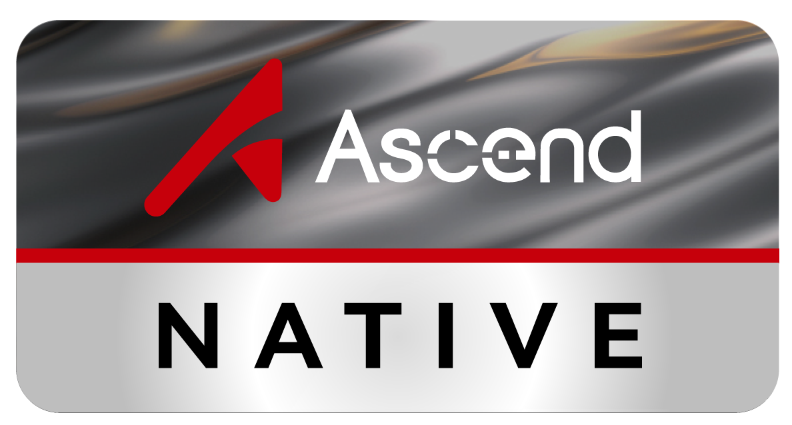
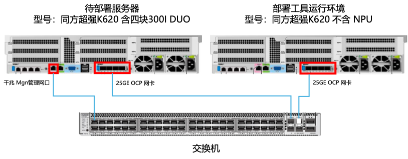

<!--  -->

# LLMOne

  <a href="README.en.md">English</a>

企业级模型部署工具，让大模型一体机开箱即用、开箱即服务

 

本项目已通过 **昇腾技术认证**

 

---

## 👋 简介

LLMOne 是一款开源、轻量的 **企业级大语言模型及应用** 部署工具，仅需十步操作，即可让大模型一体机开箱即用、开箱即服务。产品专为生产环境设计，致力于解决传统部署方案在性能、稳定性和场景支持上的瓶颈，让企业能够更快速、更可靠地在大模型一体机上部署和管理高性能大语言模型服务。

面对企业对私有大模型日益增长的需求，传统由部署工程师手动部署，带来了环境一致性差、周期长、配置复杂、运维成本高、性能与稳定性无法保障等问题，LLMOne 通过一套高度自动化的全栈部署流程，将复杂的环境配置、模型部署和应用上线简化到“点几下鼠标”即可完成，不仅确保达到企业级推理性能和系统稳定性，也大幅降低了部署与运维门槛，帮助整机商将大模型一体机转化为“开箱即用、开箱即服务”的智能基础设施，快速释放AI算力价值。

## ✨ 主要特点

- **开箱即用**：系统自动化安装，10 步操作，1 小时极速上线
- **一站式构建**：完整配套全栈 AI服务，算力、模型、应用统一纳管
- **国产适配**：支持国产昇腾等主流国产GPU芯片
- **集成主流大模型**：支持DeepSeek、千问、书生浦语等多种开源大模型

## ⬇️ 软件下载

您可以直接至 [项目 Release 页面](https://github.com/EM-GeekLab/LLMOne/releases) 下载对应平台的可执行文件进行使用。

目前已支持的操作系统：

> 由于开发组目前设备有限，我们主要支持 Windows X86 和 M 处理器的 MacOS 平台的打包与测试，如您有其他国产芯片平台的支持需求，请在 [Issues](https://github.com/EM-GeekLab/LLMOne/issues) 中反馈。

## 🚀 快速开始

要快速开始使用 LLMOne，请按照以下步骤操作：

0. 参考组网设计图，完成网络环境的搭建，确保一体机与部署工具在同一子网下。同时需要确保一体机已经接入电源，可供开机。
   
   
   同时您需要从整机商获取一体机 BMC 的 IP 地址、用户名和密码。也可以在一体机启动时，连接屏幕直接查看 BMC IP 地址

1. 下载并安装 LLMOne 客户端：

   注意，Windows 平台使用的是无需安装的便携式应用，您只需解压并运行“LLMOne.exe” 即可。
   
   MacOS 平台使用的是 DMG 安装包。您需要将 LLMOne.app 拖入应用程序文件夹中。

2. 获取 LLMOne 部署资源包：

   我们目前提供了一个资源包示例和一个资源包构建工具，您可以从魔乐社区下载 [LLMOne 示例资源包](https://modelers.cn/EM-GeekLab/LLMOne-Resource-example) 或者使用 [LLMOne 资源包构建工具](https://github.com/EM-GeekLab/LLMOne-Resource-Builder) 来创建自己的资源包。

3. 启动 LLMOne 客户端，按照[用户手册](https://geektechstudio.feishu.cn/wiki/UqP4w82n7ipacukdXe6cclL5nlb)的提示，完成配置与安装过程。

## 🗺️ 发展路线图

我们不断为 LLMOne 添加新功能和能力。以下是我们接下来的工作计划：

- [ ] 标准化应用模板，方便厂商快速将自己的应用集成到 LLMOne 中，实现一键部署
- [ ] 支持更多主流大模型的集成
- [ ] 增强模型管理功能，支持模型版本控制和多模型部署
- [ ] 支持 openGrass 等开源数据库集成

## 📝 许可证

本仓库代码均遵循 [木兰宽松许可证第2版](LICENSE)，同时兼容 [Apache License 2.0](https://www.apache.org/licenses/LICENSE-2.0) 许可证。

## 🤝 贡献

我们欢迎各种技能水平的开发者贡献！无论是修复错误、添加功能还是改进文档，您的贡献都很有价值。

请查看 [CONTRIBUTING.md](CONTRIBUTING.md) 了解如何开始。

**Contributors**

## 📚 文档

有关更详细的信息，请访问我们的[官方文档](https://geektechstudio.feishu.cn/wiki/UqP4w82n7ipacukdXe6cclL5nlb)。