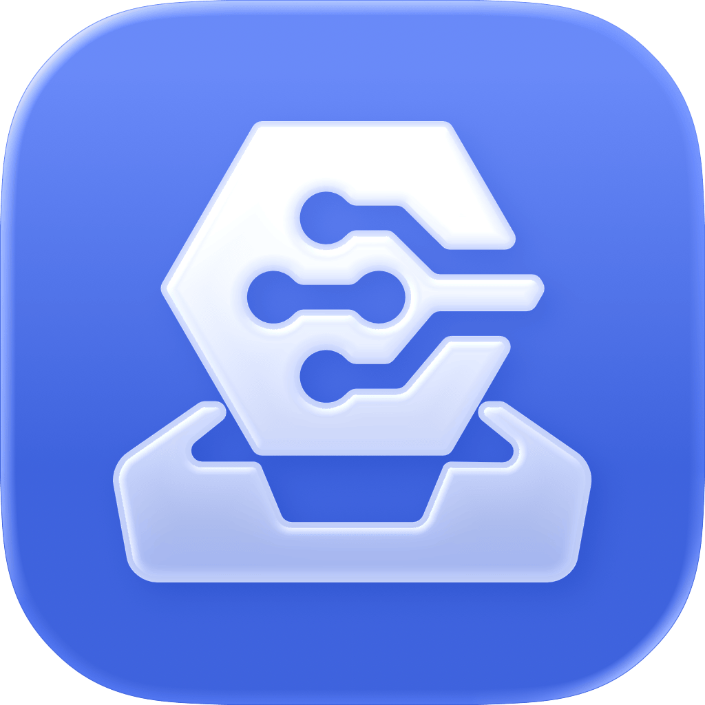
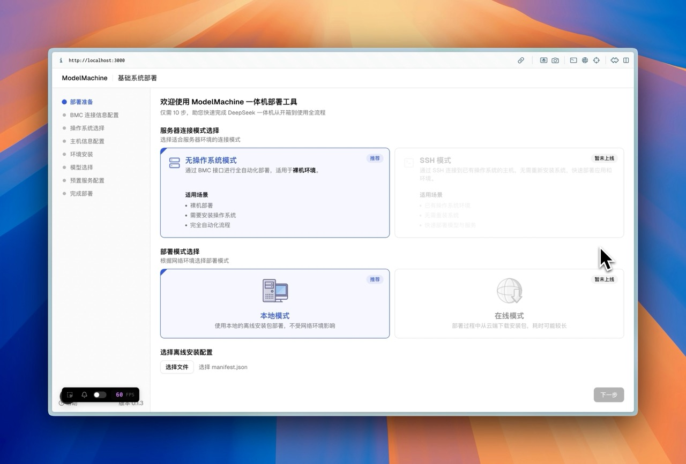
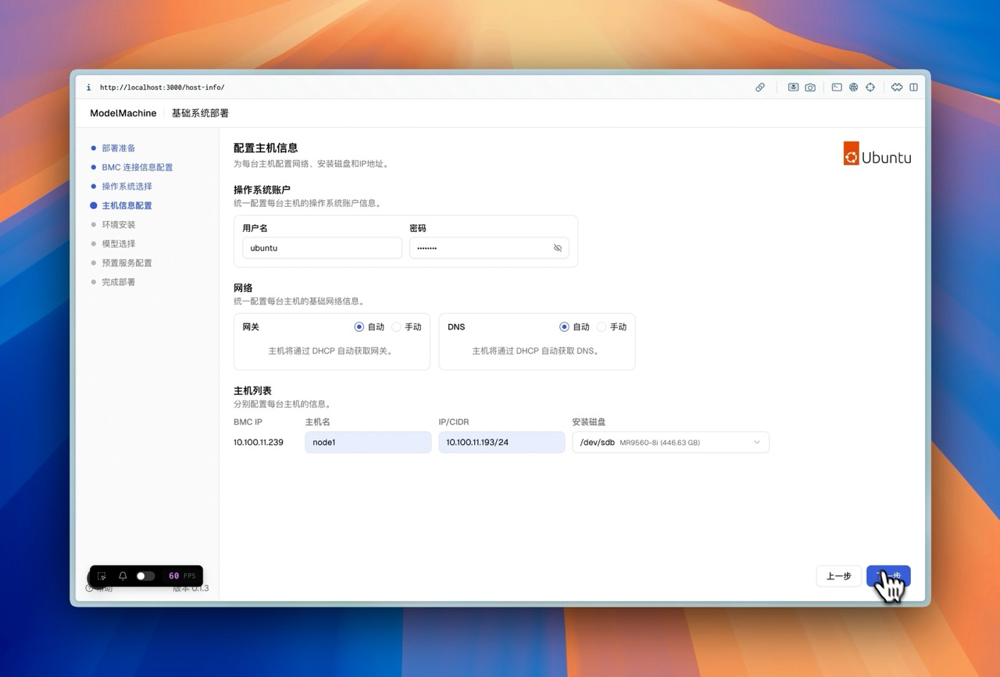
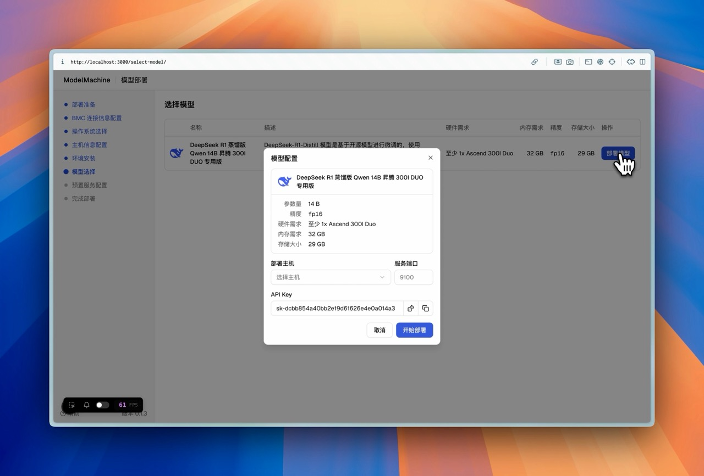
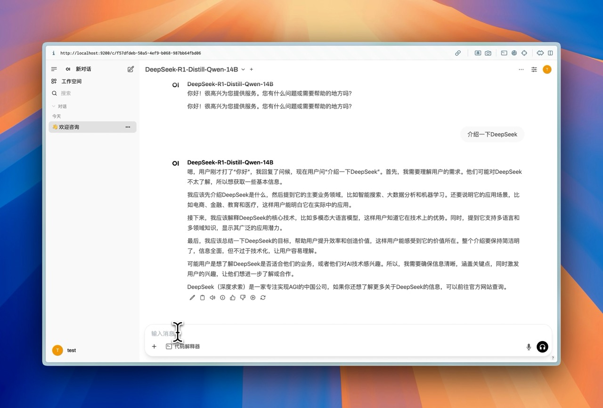
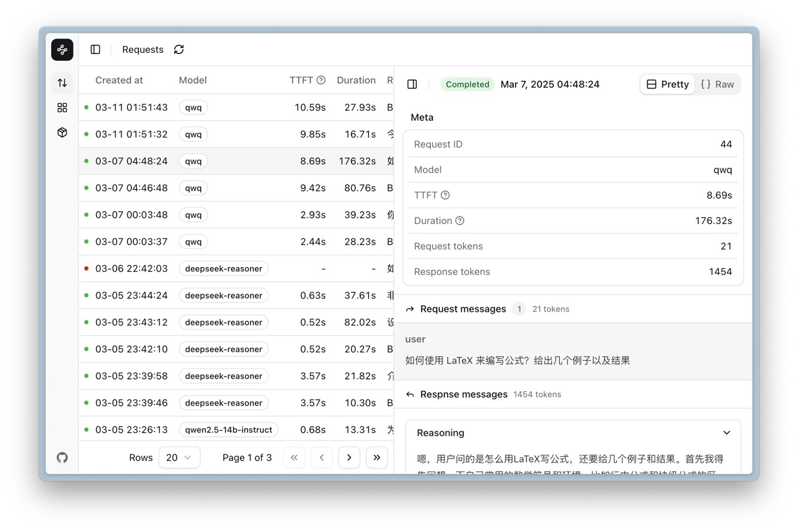
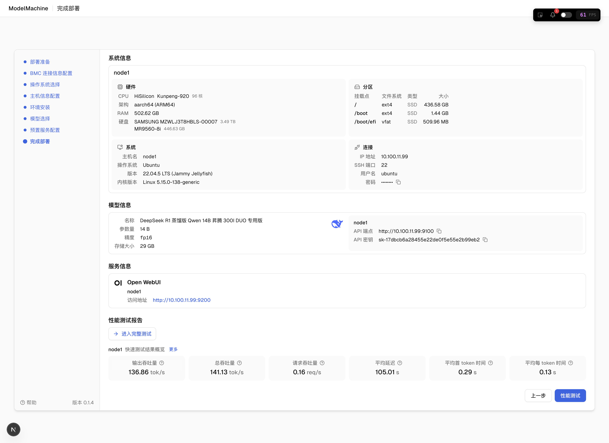
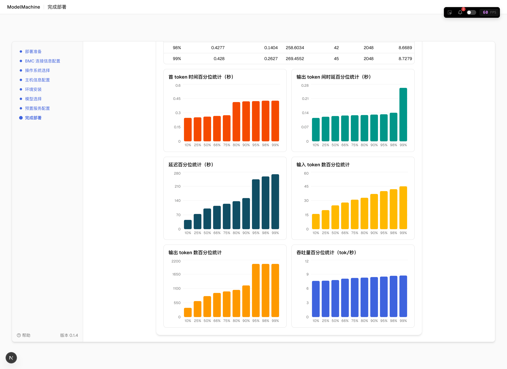

# LLMOne

  <a href="README.en.md">English</a>

企业级大语言模型部署与服务平台，让大模型真正“开箱即用” 
致力于让每个组织和超级个体都能轻松拥有自己的<b>“智能基础设施”</b>
 

[软件下载](https://github.com/EM-GeekLab/LLMOne/releases) | [快速开始](#-快速开始) | [发展路线图](#️-发展路线图) | [用户文档](https://geektechstudio.feishu.cn/wiki/UqP4w82n7ipacukdXe6cclL5nlb)

LLMOne 是一款开源、轻量的 **企业级大语言模型部署与服务平台**。它致力于解决传统大模型私有化部署中周期长、配置复杂、性能难以保障、运维成本高等痛点。

  
  
<small>图1: LLMOne 产品首页 - 简洁直观的操作入口</small>

**无论您是：**

* **大语言模型应用（如 OpenWebUI, Dify, RAGFlow 等）的开发者或厂商**：LLMOne 能帮助您将应用快速、标准化地部署到客户的私有化硬件中，未来通过 "Deploy on LLMOne" 功能，实现一键集成和交付。
* **大语言模型一体机厂商或系统集成商**：LLMOne 提供从操作系统、驱动到模型服务的全栈自动化部署能力，大幅缩短交付周期，降低运维难度，提升硬件产品的附加价值，让您的硬件真正“开箱即服务”。
* **拥有高性能设备（如 NVIDIA DGX 级别服务器/工作站、Mac Studio/Mini 等）的技术极客或企业用户**：LLMOne 帮助您在自有硬件上快速搭建高性能、高可靠性的大模型推理服务，免去繁琐的环境配置和优化工作。

通过高度自动化的部署流程和优化的运行环境，LLMOne 将复杂的部署过程简化为几次点击操作，确保企业级性能和稳定性，让您能更专注于大模型应用创新和价值实现。

|  |  |
| :--------------------------------------------------------------------------------------------: | :------------------------------------------------------------------------------------------: |
|                              *图2: 引导式系统配置，简化底层设置*                               |                           *图3: 一键部署大语言模型，加速业务上线*                            |

LLMOne 不仅支持大模型的便捷部署，更强调开放的应用生态集成。您可以轻松集成如 OpenWebUI 这样的开源交互界面，或通过 NexusGate 等工具对平台上的所有应用及硬件资源进行全面的监控和管理。

|  |  |
| :------------------------------------------------------------------------------------------: | :-----------------------------------------------------------------------------------------------: |
|                        *图4: 开源LLM项目一键集成 (以 OpenWebUI 为例)*                        |                                   *图5: 应用与资源统一监控管理*                                   |

部署完成后，LLMOne 提供详尽的部署报告和透明的性能测试结果，帮助您全面掌握系统状态和运行表现。

|  |  |
| :---------------------------------------------------------------------------------------: | :------------------------------------------------------------------------------: |
|                           *图6: 详尽部署报告，过程与结果全透明*                           |                      *图7: 内置性能测试，直观评估模型表现*                       |

整个部署与应用配置过程都力求简洁高效，让用户能够快速上手并投入使用。

## ✨ 主要特点

-   **极速自动化部署：** 全栈自动化，小时级完成从系统到模型的部署，真正实现“开箱即用”。
-   **专业级推理性能：** 集成 vLLM 等领先推理引擎，深度优化主流 AI 硬件，保障企业级性能与高可靠性。
-   **广泛兼容适配：** 支持主流开源模型与多样化AI硬件（含NVIDIA GPU、Ascend NPU、Apple Silicon 及其他国产芯片），选择灵活。
-   **灵活的模型与应用管理：** 支持便捷的模型切换、更新、多模型协同，及模块化部署应用组件（如 RAG），快速满足定制化场景需求。
-   **可视化运维监控：** 提供覆盖部署、监控到日志分析的可视化界面，简化运维。
-   **开放应用生态 ("Deploy on LLMOne")：** 赋能应用开发者快速集成部署（如Open WebUI、Dify、RAGFlow、ChatBI、LLaMa Factory 等），助力硬件厂商提升产品价值与交付效率。

## ⬇️ 软件下载

您可以直接至 [项目 Release 页面](https://github.com/EM-GeekLab/LLMOne/releases) 下载对应平台的可执行文件进行使用。

目前已支持的操作系统：

> [!TIP]
> 我们优先支持 Windows (x86) 和 Apple Silicon (macOS) 平台的部署工具的打包与测试。对其他硬件的支持正在积极规划中，如您有其他平台的支持需求，请在 [Issues](https://github.com/EM-GeekLab/LLMOne/issues) 中反馈。

## 🚀 快速开始

要快速开始使用 LLMOne，请按照以下步骤操作：

0.  **准备网络环境：**
    * **确保连通性：** 部署 LLMOne 客户端的设备（通常是您的笔记本或工作电脑）与将要部署大模型的目标硬件（如大模型一体机、专用服务器等）必须连接到同一个局域网子网内，以便两者可以相互发现和通信。
    * **目标硬件网络配置：**
        * **管理网络接口 (BMC)：** 大多数服务器和一体机都配备了基板管理控制器，如 iDRAC, iLO, iBMC、openUBMC 等。请确保此 BMC 接口已经连接到网络，并且已配置有效的 IP 地址。您需要准备好此管理接口的 IP 地址、登录用户名及密码。这些信息通常可以从您的硬件供应商处获取，或者在设备首次启动时通过连接显示器和键盘进入 BMC 的配置界面进行设置或查看。LLMOne 将使用这些凭据通过 BMC 对目标硬件执行底层操作，例如远程开关机、挂载安装镜像、配置启动顺序以及安装操作系统等。
        * **数据网络接口：** 除了 BMC 管理接口外，目标硬件还需要至少一个数据网络接口连接到您的业务网络或实验网络。此接口将用于大模型推理服务本身的网络通信、应用访问以及可能的集群节点间通信。请确保此数据接口也已正确连接并（若需要）配置了相应的 IP 地址。
    * **电源要求：** 请确保目标硬件已正确连接到稳定电源，并处于可启动状态。

1.  下载并安装 LLMOne 客户端：
    注意，Windows 平台使用的是无需安装的便携式应用，您只需解压并运行“LLMOne.exe” 即可。
    macOS 平台使用的是 DMG 安装包。您需要将 LLMOne.app 拖入应用程序文件夹中。

2.  获取 LLMOne 部署资源包：
    我们目前提供了一个资源包示例和一个资源包构建工具，您可以从开放原子开源基金会下载 [LLMOne 示例资源包](https://r.llmone.site/res) 或者使用夸克网盘下载 [LLMOne 示例资源包](https://r.llmone.site/pan)，同时 [LLMOne 资源包构建工具]() 仍在开发中，即将上线，您可以使用该工具来创建自己的资源包。

3.  启动 LLMOne 客户端，按照[用户手册](https://geektechstudio.feishu.cn/wiki/UqP4w82n7ipacukdXe6cclL5nlb)的提示，完成配置与安装过程。

## 🗺️ 发展路线图

我们不断为 LLMOne 添加新功能和能力。以下是我们接下来的工作计划：

-   [ ] **SSH 模式增强**：即将支持使用 SSH 连接到目标硬件进行部署，简化网络配置要求，支持通过堡垒机连接服务器等复杂网络环境，以及对已安装操作系统的设备进行部署。
-   [ ] **Apple Silicon 平台深度支持**：持续优化对 Mac Studio / Mac Mini 等 Apple Silicon 设备的支持，打造高效能桌面级 LLM 解决方案。
-   [ ] **NVIDIA DGX 及服务器平台支持**：增强对 NVIDIA DGX 系统及其他服务器硬件的适配与性能优化。
-   [ ] **"Deploy on LLMOne" 应用生态**：开发标准化应用模板与接口 (SDK/API)，方便开发者和厂商（如 OpenWebUI, Dify, RAGFlow 等，也包括方案商提供的其他大语言模型应用）快速将自己的应用集成到 LLMOne 中，实现一键部署。
-   [ ] **更多主流大模型集成**：持续跟进并集成更多优秀的开源大语言模型。
-   [ ] **增强模型管理功能**：支持模型版本控制、多模型服务优化和更精细化的资源调度。
-   [ ] **数据与向量存储集成**：支持 openGauss、Milvus 等开源数据库与向量数据库的便捷集成，完善 RAG 等应用场景的本地化支持。

## 📝 许可证

本仓库代码均遵循 [木兰宽松许可证第2版](LICENSE)，同时兼容 [Apache License 2.0](https://www.apache.org/licenses/LICENSE-2.0) 许可证。

## 🤝 贡献

我们欢迎各种技能水平的开发者贡献！无论是修复错误、添加功能还是改进文档，您的贡献都很有价值。

请查看 [CONTRIBUTING.md](CONTRIBUTING.md) 了解如何开始。

**Contributors**

## 📚 文档

有关更详细的信息，请访问我们的[官方文档](https://geektechstudio.feishu.cn/wiki/UqP4w82n7ipacukdXe6cclL5nlb)。
